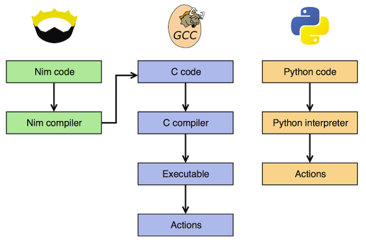

# Pythonに秘伝のタレをかけた言語Nim

---

#  Nim 
- Python風の静的型付けコンパイル言語
	- 2019年9月にv1.0正式リリース

```nim
echo "Hello World!"
```

---

# 秘伝のタレ３つ

---

# １．圧倒的な速さ

---

# フィボナッチ数列の42番目を計算する時間


<span style="font-size: 18px;">参考：[この頃 流行りの 言語たち（他）でベンチマーク （Dart, Go, Julia, Nim, Python, Rust 他） - Blank File](http://h-miyako.hatenablog.com/entry/2015/01/23/060000)</span>

---

# Nimが速い理由
NimコンパイラはCコードを吐ける


---

# ２．関数呼び出しが楽しい

---

# Nimの関数呼び出し

```nim
echo("aaa") # 普通に

# Command invocation syntax
echo 1 # ()を省略
echo 1, 2 # 複数引数もいける

# Method call syntax
1.echo() # echo(1)と等価
1.echo(2) # echo(1,2)と等価
1.echo # ()を省略
1.echo 2 # ()を省略
```

---

# Method call syntaxが楽しい

| 通常                                       | Method call syntax                    |
| ---------------------------------------- | ------------------------------------- |
| days(1)                                  | 1.days                                |
| parseFloat(“1.23”)                       | “1.23”.parseFloat                     |
| int(parseFloat(“1.23”))                  | “1.23”.parseFloat.int                 |
| isZone(fromUnix(123), local())           | 123.fromUnix.isZone(local())          |
| strip((toLowerAscii("I AM")) | "I AM".toLowerAscii.strip |

---

# つなげて書ける
- Nim
  ```nim
  @[1, 2, 3, 4, 5]
    .mapIt(it*2)
    .filterIt(it < 5)
    .foldl(a + b)
    .echo
  # -> 6
  ```

- Python
  ```python
  l = [x*2 for x in [1, 2, 3, 4, 5] if x*2 < 5]
  result = reduce(lambda a, b: a+b, l)
  print(result)
  # -> 6
  ```

---

# ３．オレオレ構文が書ける

---

# 関数を生成するマクロ

```nim
import macros

macro gen_hello(): typed =
  let source = """
    proc hello() =
      echo "hi"
  """
  result = parseStmt(source)

gen_hello()
hello()
# -> hi
```

---

# 文字列からEnum型の変数を生成するマクロ

抽象構文木（AST）をいじれる

```Nim
import macros, strutils

macro toEnum(words: static[string]): untyped =
  result = newTree(nnkEnumTy, newEmptyNode())

  for w in splitWhitespace(words):
    result.add ident(w)

type
  Color = toEnum"Red Green Blue Indigo"

var color = Indigo
```

---

# ブロック内をPrintするマクロ

```nim
import macros

macro print(body: untyped): untyped =
  result = newStmtList()
  for line in body:
    result.add(quote do: echo `line`)

let name = "happy"

print:
  "i"
  "am"
  name
  
# -> i
# -> am
# -> happy
```

---

# 関数名をプリントするマクロ

```nim
import macros

macro echoName(x: untyped): untyped =
  let name = $name(x)
  let node = nnkCommand.newTree(newIdentNode(!"echo"), newLit(name))
  insert(body(x), 0, node)
  result = x

proc hello() {.echoName.} =
  echo "world!"

hello()
hello()

# -> hello
# -> world!
# -> hello
# -> world!
```
---

# まとめ

-  Nim
Pythonに秘伝のタレをかけた言語
  - １．Cコードに変換するので速い
  - ２．`“1.23”.parseFloat.int`
  - ３．オレオレ構文が書ける

