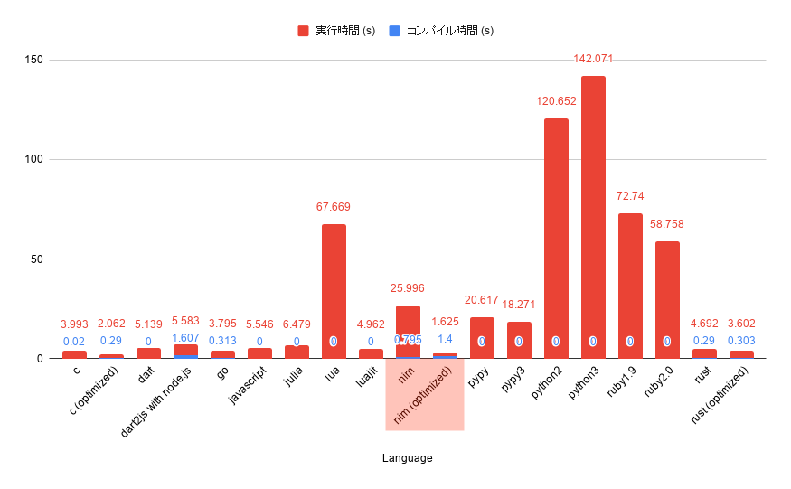

# Pythonに秘伝のタレをかけた言語Nim

---

# Nim
aaa

---

# 最近v1.0になった
aa

---

# 個人的に魅力を感じる
# ３つのポイント

---

# １． 速い

---

# フィボナッチ数列の42番目を計算する時間

参考：[この頃 流行りの 言語たち（他）でベンチマーク （Dart, Go, Julia, Nim, Python, Rust 他） - Blank File](http://h-miyako.hatenablog.com/entry/2015/01/23/060000)

---

nimが速い理由をかく

---

# ２．関数の呼び方が楽しい
pythonの呼び方と比較でかく

---

# ３．メタプログラミングが楽しい
pythonの呼び方と比較でかく

